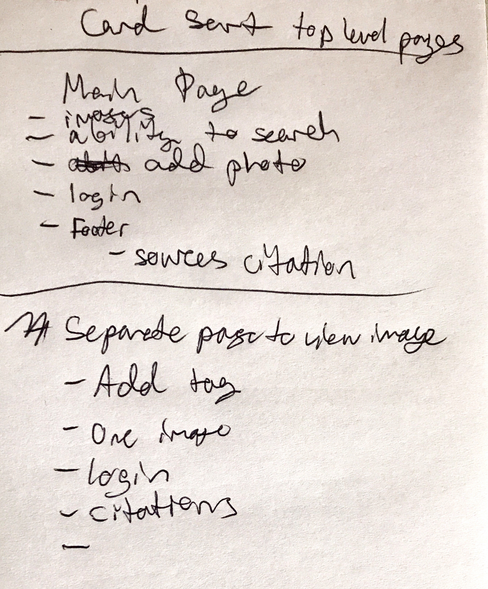
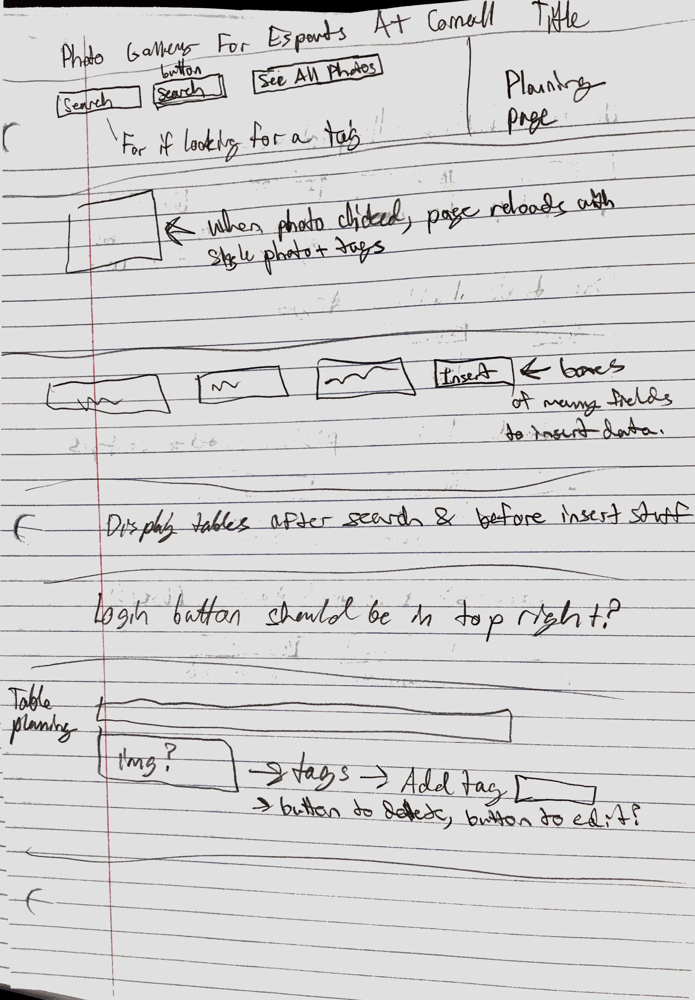
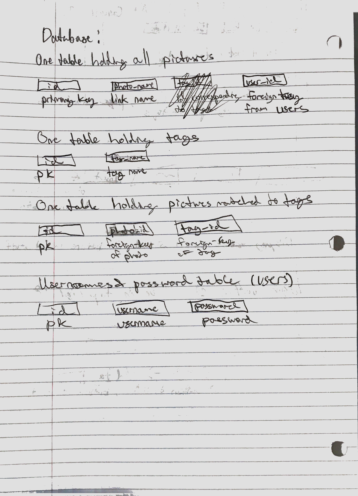
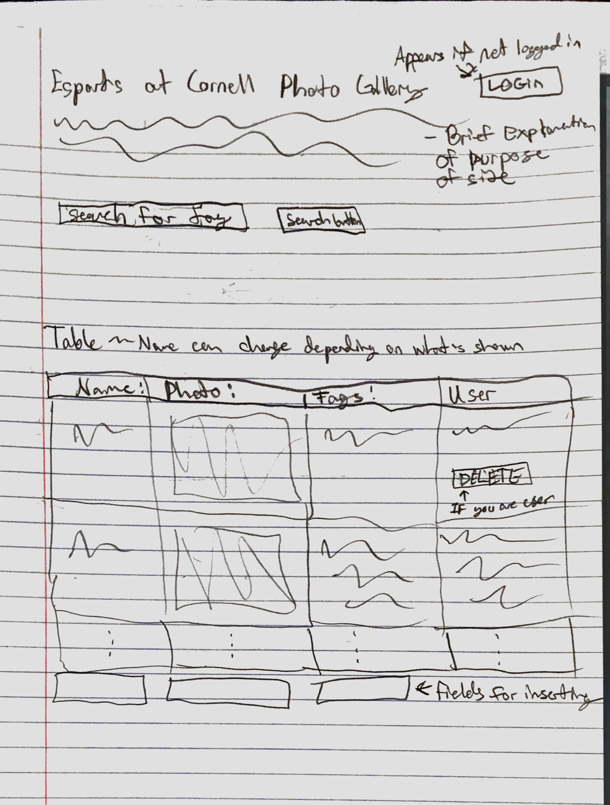
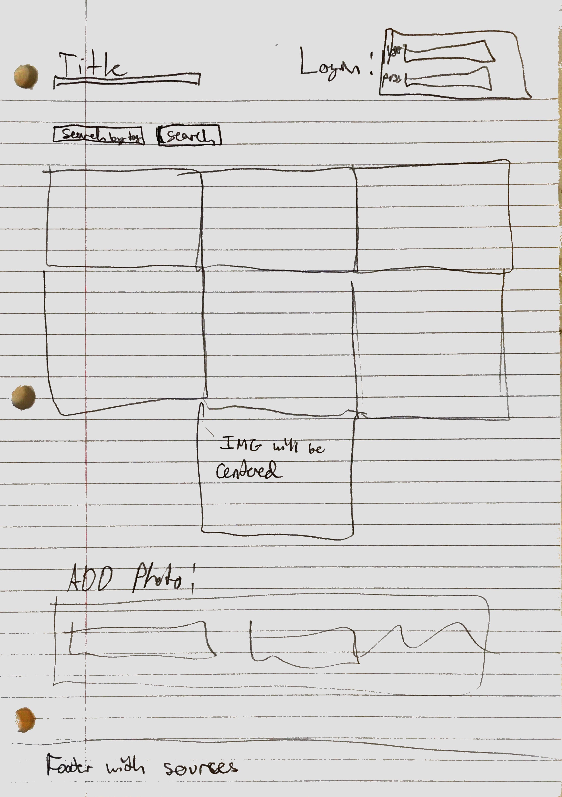
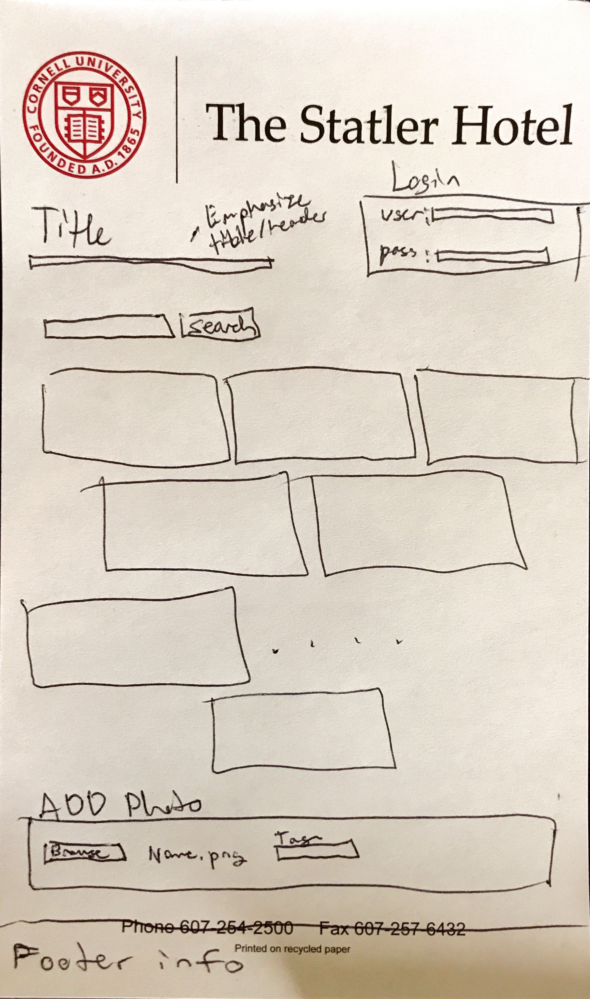
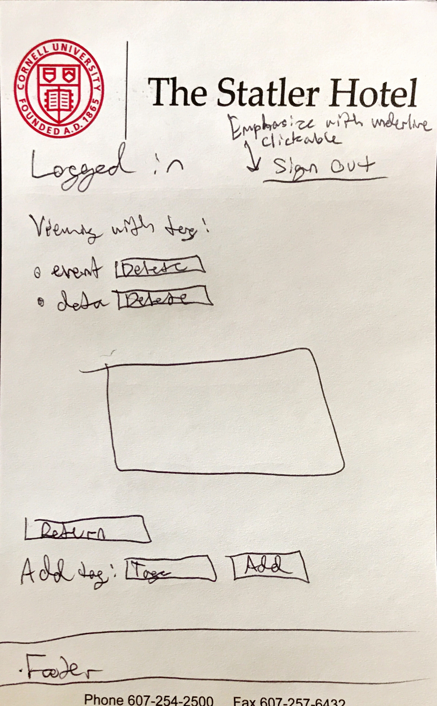
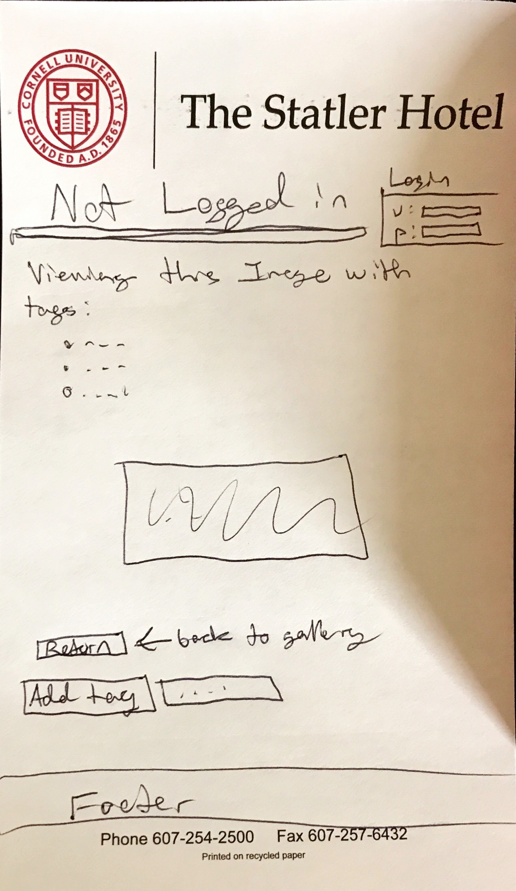
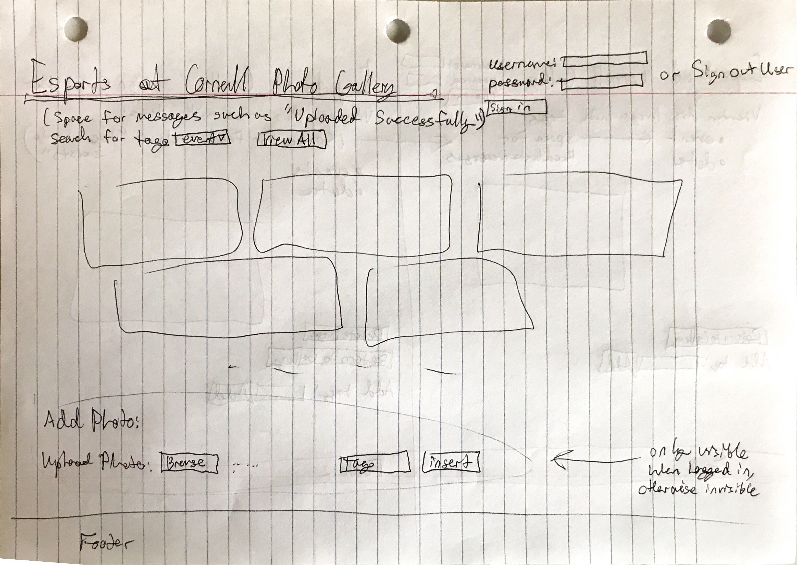
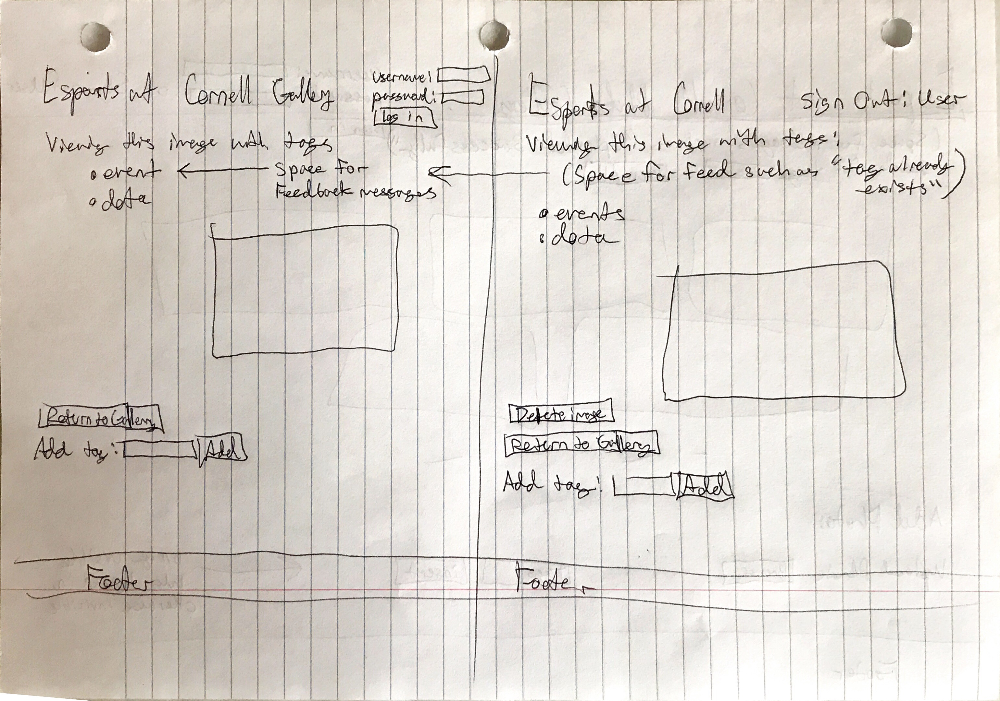

# Project 3: Design Journey

Your Name: Rose Zhou

**All images must be visible in Markdown Preview. No credit will be provided for images in your repository that are not properly linked in Markdown. Assume all file paths are case sensitive!**


# Project 3, Milestone 1 - Design, Plan, & Draft Website

## Describe your Gallery

My gallery will be about showing, storing, and uploading photos that belong to my club, Esports at Cornell. The gallery will let you search using a tag for the photos you want. This gallery is meant for showing and storing photos for administrative officers of my club, which is useful to them to see what kinds of event covers were used in the past. Our sponsors also like to see event covers as proof that we host events. Other stored images could be used by our graphic designer in future work as well such as making more event covers using photos taken at events.


## Target Audiences

Audience 1: The administrative officers of the club.

These people are a target audience because they will need to reference photos in situations such as making facebook cover photos, making montage videos, creating other promotional flyers, or making facebook albums. Making a database to search efficiently would speed up being able to find the photos needed, especially if needed photos are labeled as belonging to a certain category(ex. the photos are of a particular event, or are relevant to multiple events). For example, our graphic designer would want certain photos from events in case of making a poster, or if we didn't have enough time to make an event photo, we could reuse an old one. The form makes it easy to search for photos with a certain tag since a drop down prevents any spelling errors or misconceptions of what an event is called by showing only tags that are used. The drop down also allows users to see all tags at once. Then, adding multiple tags allows officers even those not loggged in to make sure a photo is categorized approproately and will show up in relevant searches. For example, maybe in my opinion when I upload a photo I don't think it should be labeled as a "club photo", but someone else will think it should be, so they can tag it as a club photo. Other people could end up thinking that adding that tag would make sense, so when they search for "club photo" intending to find that picture, they will end up finding it.

We also tend to upload many images at once with wanting only one tag on an image. So, after someone uploads an image, I have the page reload to the main page due to convenience. I could have it load in the single view where you could add more tags, but officers would prefer to have it direct to the main page since having one tag on an image is preferable (when you initially upload it) and it is more convenient for them to go back to the main page to upload many pictures in succession.

I have login/logout redirect to the same page as well out of convenience in the case an officer would want to add tags to a single photo they were looking at or add a photo while viewing the main page.

Audience 2: Current Sponsors (such as Tespa)

Current sponsors require photos of events as proof that we use sponsorship packages/money for their intended use such as events (and not using their money for other things). So, having a database of organized photos will make it easy for sponsors looking at the site to find the photos relevant to proving that we are using money/packages for events. An example is if a sponsor gives us money to fund an event called "Spring Festival", then they would need to search for photos taken at the Spring Festival to see proof that we used the money for its intended purpose. They would search for all photos tagged with "spring festival" and with this form it will be easy to search for proof.

Any other demographic has no use for this site pictures here.


## Design Process

Cardsort from 3/20/19 where after sorting I wrote it down on a notepad for what features should be included on top level pages. I decided where to put everything based on specification of the project and thinking of what my target audience needs. Main page should have everything listed bc they are what functions I asked users about that they would want to see on the main page. Then, the sepearte page to view a single img has its elements because after asking users, I found that they would prefer these features to be placed here out of convenience and logical use.


First sketch roughly outlining website plan. I didn't put anything in place for a specfific reason, this is just a rough sketch:


First planning for database sketched out on paper:


Final decided sketch so far for website at the time:


This was my first finalized sketch/plan, I will think of better reasons and places to put things later on but so far my decisions were made as a starting point without thinking of usability:


This is my second sketch:
I created this one thinking that having the login input and output available there instead of as a button will be more convenient, especially if you are already on the main page and want to add a photo quickly. I am thinking of doing the same where login on a single img view will be the most convenient.
I am not sure yet about other features since I am unsure of what I need for my target audience.


Another sketch drawn on 3/27, I will probably go with this one for the final version. I put more thought into why each element is there for a reason. It has the title emphasized and the login area is in an easy to see area, especially at the top as the first thing you see when you visit the page. Then, the search will be a drop down of all existing tags and the search button will be next to it to make it easy to search. I haven't thought of viewing a single img yet since I don't understand query string parameters yet. I changed the imgs to be staggered instead of in a table style so that imgs take up as much space as possible and are all the same height. Otherwise, the varying image sizes fit into a table would not work out and look odd. I have the area to add photos at the bottom since users might want to skim available images first before adding one. Especially after searching or viewing all images, users would decide whether they want to upload their image as they could see that their image has already been uploaded by someone else. Or, they could see a similar image such as a similar event photo and decide the database doesn't need more images of this type.


4/1/19 Now that I learned how to use query string parameters, I understand how to view an image on its own page. So, I decided to have to my page organized as such where login/logout look almost identical except while logged in will allow user to see a delete button next to a tag, allowing the user to delete unwanted tags. Users should delete tags they don't want on their imgs since as they uploaded it, they have the best judgement as to whether that tag belongs there or not and should be able to decide to remove it. I also have the signout link available on that page for convenience that will redirect to that same page, and it will be underlined to emphasize that link is clickable and clarify that is how users should logout. Otherwise, it could be hard to find the logout link.

logged in page

not logged in page


4/6/19 These are definitely my final decided sketches. Everything is finalized and placed where it is for a reason. Changes to the single view image page from 4/1/19 include that I forgot to add the "delete img" button on the logged in page if the user owns that img. The user that uploaded that img should have the ability to delete it if they decide that it is no longer relevant/mistake. This is due to the user having the best judgement, as anyone else doesn't have the background knowledge or know more about this img compared to the person who uploaded it. Therefore, owning the picture gives the user that uploaded it the authority to delete the picture. Also, forgot to mention that viewing an image that you don't own will have the page look the same (except for signout) as if you weren't logged in. It will look the same since there are no new options that being logged in will give you if you didn't upload that img. Then, I removed the boxes around the add tag area, login area, and add photo area since they turned out to look much better on the live site without a box. It also looks less cluttered removing the boxed outlines. I also made slight adjustments where I added a label to the search form saying "search for tag" to clarify to users that this is the search area. I also forgot to add a button to "view all" images in the gallery out of convenience, in case users wanted to see all images. I also finally decided to keep images in a centered style since a table style view in my earlier sketches doesn't look as great (uploading random image sizes would mean fitting varying images into table cells), while the centered style of imgs will take up as much empty space as possible with all photos at the same height, making them look like building blocks that build up the page in an aethestically pleasing way. I then added labels to the add photo area to clarify which button was for uploading, tags, and uploading. I've also kept the search ability to a drop down showing all existing tags since users uploading could want to see what tags exist, avoid misspelling a tag, and want suggestions to what a tag name could be. For example, I could see that a "event" tag exists and I would then think "maybe I can make a tag called first event" and put that on this picture. Users would then know what tag they should probably put on their image as seeing the existing tags will show them the categories other people have put imgs under. I also plan to not have tags deleted if no images are still using them, since maybe someone in the future will want that tag and seeing that tag will suggest to them that maybe this tag name would be a good tag to use. I've also moved the login button to under the password input as it is more convenient for a user after entering their password to click and see the button. I placed the view all button near search to be easier to see as users right after seraching would want to view the whole gallery again, and since they just clicked on the serach area they will still see that area. I kept the add photo area in the same place for the same reason as the last sketch. There is also some space under the title for feedback messages such as "Uploaded image sucessfully", "tag already exists", and "Search results for:". These feedback messages are important for telling the last action the user did, such as what tag they searched for, as well as why they aren't allowed to use a certain tag. All these feedback messages will be in the same place so that the user will notice that all feedback appears in this area, so if a message appears there, they will recognize that the message is probably a feedback message. In certain cases, users will not see a message, such as "tag uploaded sucessfully" because results will be obvious, such as seeing that the tag has been added to the list of tags. A dark pattern background will also be used to contrast with images and make them easy to see since most images are going to be lighter in color. As a compromise, the background should be more gray in color than black for some rare darker photos. When no images appear in search, I will fill the space with "no images" appearing to clarify that no images matching this tag exist.



## Final Design Plan
I've decided to use my final sketches as my final plan. All the reasons mentioned above are why I think this page is the most convenient for usability.
Brief Summary Explanation:
- only officers would want to login to upload, or even use the site for tagging imgs, so all decisions related to how to add tags or delete tags are targeted towards officers
- Otherwise, features are for both officers and sponsors
- username and password input available is the most convenient comapred to a separate login page
- able to login on same page is most convenient due to reasons mentioned for my "target audience section" above (easy to add tag or delete img, convenient to upload).
- the space for feedback messages is the first thing users will see since it is at the top and in large font
- feedback messages will include (image uploaded sucessfully, search results for "tag name":, image successfully deleted, veiwing all images) as these messages are the most important for clarifying whether an action was done.
- I decided a dark pattern background would be good contrast for users to see images, as all photos our club will upload will be lighter in color, so all photos will be the most visible this way. Since the background is more gray, darker images will appear fine as well in a rare case that is needed.
- i decided that all images will be the same height but varying widths to preserve the img ratios but also have a nice building block style that lets imgs take up as much space as possible while also looking nice.
- add photo is at the bottom for the same reason mentioned above (users will want to search and see if other photos already in gallery are in there already or similar enough that upload is not needed)
- view all button is at top for easy access after a search, and is near search area (since people read left to right, it'll be easier to spot)
- add photo is not visible if not logged in, no point in having it there if anonymous users can't upload, that would be confusing
- footer is at the bottom to show source information about contents, as typically people don't need to see that information first/not most important info.
- when no images match a search tag, I will have "No images" appear to clarify to users as feedback that no images exist for this tag.
- no officers have visibility issues so there is no point having descriptive img alt text, so only having "gallery img as alt text is enough to communicate in the case what the img is. Name of the image does not matter and is not useful. An image is only useful if you can see it (for target audience) so adding features like descriptive alt text is pointless.
- when username or password is wrong, feedback appears next to "view all" button to show that this message is different from other feedback and only pertains to login, as other feedback is about tags and images

Specific new info not mentioned above for final implementation of img pages:
- feedback for inserting tags will be in red to emphasize errors, as tags will take up more space and are white in color. So, feedback will stand out when the page gets more filled with tags
- tags will be in a list style to be easy to read and easy to find. The tags as they accumulate should be first seen instead of the image since the user would've clicked on an image and therefore already know what the image is. Officers would intend to click on an image to see tags, while our target audience of sponsors would liekly not click on any images. Sponsors don't particularly need to care about tags, they only need to see images after a search for relevant tags/photos, so the tag list view is mainly for officers. Being easy to read is important because it makes it more efficient and fast if officers need to see tags and decide to delete them, or if they are curious to know what tags are associated with this image. It would also be annoying if the officer was looking for the tags and couldn't find them.
- the delete img button will be under the photo because a user would want to delete after seeing all tags for the image, so after reading a list of tags the users eyes will be drawn to the area right below it, where the delete button will be (since people read top to bottom)
- delete is only visible if logged in to avoid confusion, because if user doesn't own img, they have no use for it/not allowed to delete
- return to gallery button is below delete button for convenience as after reading the tags, they might want to return to main page right away
- delete and return are in the same area to imply that clicking either button will return you to the main page. The implication comes from grouping them together here so subconsciuosly after a while users will realize this area is for features that return to the main page. There should be no confusion as to which button is the delete button since the delete button will look distinctly different with different font color and size, to avoid accidentally clicking delete when wanting to click return
- add tag is still at the bottom because of reason above

Seed images will also be properly cited so those imgs in the gallery will have a citation under them, but will otherwise not look that different from the final sketch


## Templates
Template decisions:

- out of convenience, head data such as <meta> and css links will be a template to be reused since information is needed on all pages
- footer is needed on all pages to source the background and seed photos
- headers will be a template as some headers are needed on all pages
- init is needed on all pages for login logic handling since all pages have login and it declares $db
- init will also contain logic for delete tag, delete image, add tag etc to keep other php pages less cluttered as some functions are reused. init will not include insert image because that functionality is exclusively used for that page and should never be needed to be put in here, thefore no point to do doing so.
functions like printing records cannot be reused as a template because certain cases require very specific ways of printing that are not reusable
- login is a template since all pages need the ability to login and be redirected to the same page after logging in and out.


## Database Schema Design

```
movies (
id : INTEGER {PK, U, Not, AI} -- surrogate primary key
field2 : ...
...
)
```
```
users(
  id : INTEGER {PK, U, Not, AI} -- surrogate primary key
  username: TEXT {U, Not} -- username
  password: TEXT {U, Not} -- password
)

images(
  id: INTEGER {PK, U, Not, AI} -- surrogate primary key
  name: TEXT {U, Not} -- name of image
  user_id: INTEGER {U,Not} -- foreign key corresponding to user who uploaded photo
)

tags(
  id: INTEGER {PK, U, Not, AI} -- surrogate primary key
  tag_name: TEXT { U, Not} -- name of tag
)

image_tags(
  id: INTEGER {PK, U, Not, AI} -- surrogate primary key
  img_id: INTEGER { U, Not} -- foreign-key coressponding to img
  tag_id: INTEGER {U,Not} -- foreign-key corresponding to tag belonging to img
)
```
updated planning
```
need an img table to hold name, as one image has one name, I decide to not have a column for file extensions because it'll be in the full name anyway, saving space. Then the img keeps the foreign key of user_id to know what user it belongs to. This is not a many to many relationship so the user it belongs to should be stored in this table. Then, i need a sessions table to hold sessions belonging to a user as a user can have many sessions. (one to many) the tag table is jsut tags that match to img_tags for keeping track of what tags exist

CREATE TABLE imgs (
	id INTEGER NOT NULL PRIMARY KEY AUTOINCREMENT UNIQUE,
	name TEXT NOT NULL, names are not unique
  user_id INTEGER NOT NULL not unique cause user has many imgs
);
need a tag table due to many to many relationship, keeps track of all tags
CREATE TABLE tags (
	id INTEGER NOT NULL PRIMARY KEY AUTOINCREMENT UNIQUE,
	name TEXT NOT NULL UNIQUE specification of project is unique tags
);
an image can have many tags and tags can have many images so it makes sense to implement the many to many relation with this table keeping track of relationships of imgs and their tags
CREATE TABLE img_tags (
	id INTEGER NOT NULL PRIMARY KEY AUTOINCREMENT UNIQUE,
	img_id INTEGER NOT NULL, cant be null just impossible to have this, but is not unique cause many to many relation
  tag_id INTEGER NOT NULL same as above
);
need users table, each user has only one username and password
CREATE TABLE users (
	id INTEGER NOT NULL PRIMARY KEY AUTOINCREMENT UNIQUE,
	username TEXT NOT NULL UNIQUE, usernames should be unique and not null for an account to exist
  password TEXT NOT NULL passwords cant be null but can be shared
);
need sessions for tracking logins, may need more than one session per user due to logging into multiple places so it is in its own table
CREATE TABLE sessions (
	id INTEGER NOT NULL PRIMARY KEY AUTOINCREMENT UNIQUE,
	user_id INTEGER NOT NULL, must have a user_id
	session TEXT NOT NULL UNIQUE session ids should be unique and exist
);
```
## Code Planning
Top level pages:
Will have a single page to show all images, serach results of a tag, and the add photo portion
Ill have a separate page for displaying a single img, it makes more sense to make query string parameters easy to implement

Planning templates:

- I'll need a header template, footer, head data, init, and login since they'll all display elements or send information to the top level pages.
- mentioned earlier in template section

Php code needed:
- all mentioned below

```
//search
if(serach pressed isset$_POST['search']){
  SELECT * from imgs where filtered post input matches the search name
  display all imgs using print records/display table defined elsewhere
}
function is_user_logged_in() {
  if user is logged in, return true
  otherwise, return false
}

// Show logout, only if user is logged in.
if user is logged in (is_user_logged_in()) then
  show logout link
else
  show login link
end

//find a user function used in login
function find_user{
  find user using sql
  SELECT * where username and password = entered filtered input
  if found, return their record
  if not, return null to indicate user has not been found in database
}

//find a session
find session(sessionnumber){
  see if session exists for if need to login user SELECT * from session where userid = current user
  if exists, return record of session
  if not, return null to indicate Doesn't exist
}

//session login
session login(find session(sessionnumber)){
  login if session already exists
  check if SELECT * FROM session WHERE userid = current user id return a record
}

// is user logged in
function is user logged in{
  see if user is logged in, return true or false
}

// check for login or logout requests, or check to allow user to stay logged in
if(... logic seeing if login is $_POST login is set and there is a current user){
  logout user
  remove cookie from browser by expiring it
  remove the session from the sessions table DELETE cookie from sssions where cookie = cookie;
}

//deleting img
function delete_img{
  if delete button pressed, delete img using sql queries DELETE FROM imgs WHERE imgid = id, remove img from uploads/imgs, remove corresponding records holding tags the img had in img_tags table
  DELETE FROM img_tags WHERE imgid and tag id match
  parameters will be filtered when put into sql queries
}

//add tag to existing img
function add_tag{
  check if tag already exists SELECT * FROM tags where name = entered filtered input
  if not, add tag to tags table INSERT INTO tags VALUES filtered name
  check if image has tag arleady SELECT * FROM img_tags where img_id = imgid AND tag_id = tagid;
  if not, add record to img_tags table to record that this img now has that tag INSERT INTO img_tags img_id and tag_id
  if already has, tell user that tag exists alrady
}
// something to display all images for a given list of records
function display_table($records){
  foreach($record in $records){
    records is grabbed earlier using SELECT * FROM imgs;
    echo the table row and table data with img src = name.nameextension where name is $records['id']
  }
}
//insert img
$uploaded = false;
if upload button pressed(isset($_POST["insert"]) && is_user_logged_in() && isset($_POST['insert_tag'])){
    // add tag into database if doesnt exist yet
    filter input
    check if tag exists "SELECT * FROM tags WHERE name LIKE :tag"; // see if tag is already in database
   $params = array(
      ':user_id' => $current_user['id'], //
      ':file_name' => $filename,
    );
    insert: "INSERT INTO imgs (name, user_id) VALUES (:file_name,:user_id);";
    move uploaded file to new place: move_uploaded_file($_FILES["img"]["tmp_name"], $new_path);
    see if img already has this tag: filter_input(INPUT_POST, 'insert_tag', FILTER_SANITIZE_STRING);
    $checktagrecord = exec_sql_query($db,$checktagsql,$params)->fetchAll();
    if(sizeof($checktagrecord) == 0){// if tag doesnt exist insert new tag
      insert into img_tags :"INSERT INTO tags (name) VALUES (:tag);";
    }
    get tag id sql: "SELECT id FROM tags WHERE name LIKE :tag;";
    $tagidquery = exec_sql_query($db,$gettagidsql,$params)->fetchAll(); // tag must be in database now guaranteed
    $params = array(
      ':img_id' => $lid,
      ':tag_id' => $tagidquery
    );
    put tagged img record into table: exec_sql_query($db,"INSERT INTO img_tags (img_id, tag_id) VALUES (:img_id, :tag_id)",$params);
    $uploaded = TRUE; // has been uploaded
    get all record to display for main page
}

//grab tags
// grab records of all tags
$tagsql = "SELECT * FROM tags"; get all tags for the search area
$tags = exec_sql_query($db,$tagsql)->fetchAll();
function print_tags($tags){
  foreach($tags as $tag){
    echo "<option value = '".$tag['name']."'>".$tag['name']."</option>";
  }
}

//delete tag
function delete tag{
  if button pressed, grab query string values for img id and post input for tag id
  DELETE from img_Tags where tagid and imgid = filtered input;
}


```
//
-------------------------------------------------------
```
```

```
## Database Query Plan

to get all images to display
SELECT * FROM images;

To get searched photos using tag:
SELECT * FROM images LEFT OUTER JOIN image_tags ON image_tags.img_id = img.id LEFT OUTER JOIN tags ON image_tags.tag_id = tags.id WHERE tags.name = :search;

To insert photo:
INSERT INTO photos (attributes) VALUES(user entered values from form, also the username);
SELECT * from tags where tagname = entered tag;
if tag not found from above query:
Insert into tags tag name = filtered input
finally
INsert into img_tags imgid = imglastinsert and tagid = tagfound or taglastinsertid;


May need query to find tags in search form drop down:
SELECT * FROM tags;

delete tag from img
DELETE FROM img tags where img_id =:img_id AND tag_id = :tag_id;

add tag to single img:
check if tag exists
SELECT * from tags where filtered tag input = tag_id
if tag already exists
SELECT id from tags where filtered tag inout = tag_id
finally
INSERT into img_Tags where img_id = :imgid and tag_id = either found id before or the lastinsertid of tags table;

to check username and password:
SELECT * from users where username = filteredusername and passowrd = filtered password input;

to check session existence:
SELECT * from sessions where cookie = current cookie;

to delete session id/ logout:
DELETE from session where cookie = deleted cookie;


# Project 3, Milestone 2 - Gallery and User Access Controls

## Issues & Challenges
Problems from first milestone 2
- unfortunately the site keeps saying I don't have an imgs table, even though it worked at first then I added an insert statement and it broke, removing it still had the errors. I tried for 4 hours to fix this and couldn't.

- I referenced the login code given in lab 8 and typed it all out for when I can fix the first issue. Login seemed to work fine before the above issue occurred

- I will implement user access controls when the issue is fixed

after finishing project:
My worst problems were making sure that I fulfilled every requirement and understood what was being graded.
Otherwise it was okay from debugging
# Final Submission: Complete & Polished Website

## Reflection

I definitely learned how to plan much better and figure out how to look for help (using campuswire) plus understanding the specifications.
I've also learned how to prepare sql queries. At first i didn't understand that I could just put parameters directly into exec_sql_query instead of declaring a varible first like exec($, "asdfasdf", array()) instead of exec($db, $sql, $params). Now i understand programming much better in that way. I've also learned that feedback form info is useful to a programmer for debugging, even if the project doesn't require it.
